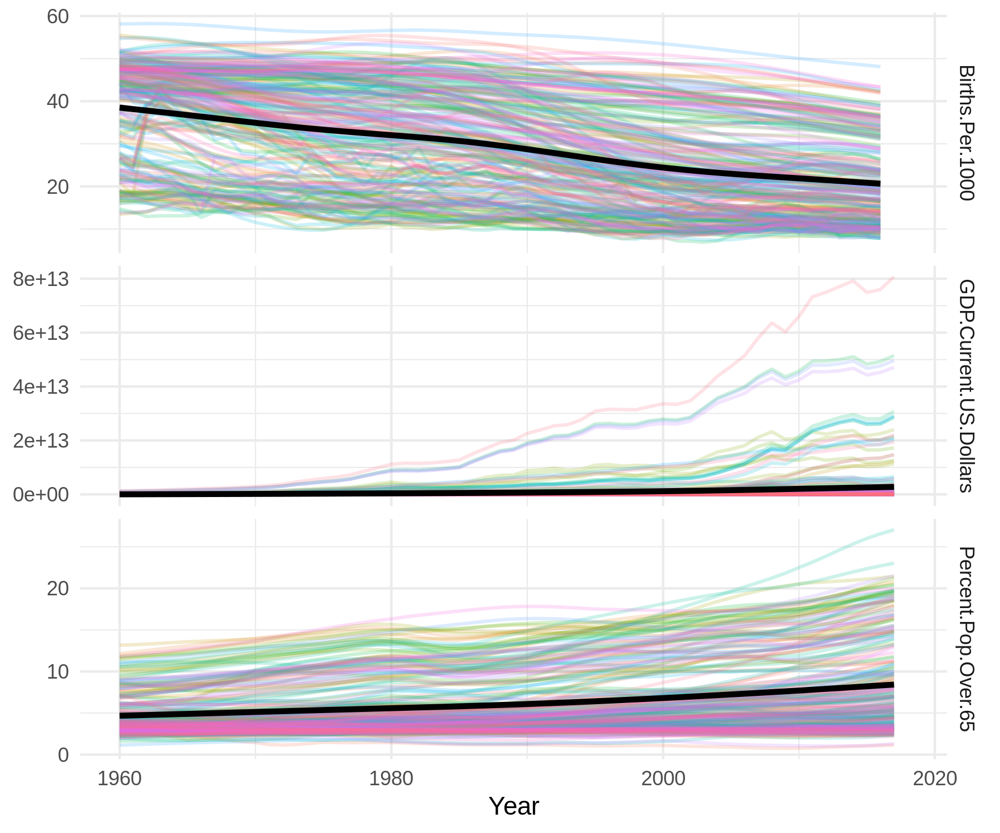

## As the wealth of a nation increases, demographics change

Over time, the world has become wealthier. Some nations experienced
greater financial growth than others over the last half-century. As 
Gross Domestic Product (GDP) in a country increases, two major trends occur: 
first, birth rate decreases, and second (as a natural consequence), 
the average age of the population increases. The average trend over time
is indicated as a thick, black line.

[GDP](https://data.worldbank.org/indicator/NY.GDP.MKTP.CD), 
[birth rate](https://data.worldbank.org/indicator/sp.dyn.cbrt.in), and 
[aging population](https://data.worldbank.org/indicator/SP.POP.65UP.TO.ZS)
datasets are all made available by 
the World Bank.

## Most of the world economies grew predictably, but there are outliers

From 1960-2017, the average national GDP (across the globe) grew 10,000 
times larger. Of course, there was a distribution around that average. 
The distribution appears bell-shaped when GDP is displayed on 
a log-scale. On the plot below, the average is indicated, as are three 
standard deviations above and below the mean (a simple test for outliers).
There are two outliers that pass this simple test above the mean 
(much greater growth than average), there are none that pass the test below
the mean. The five countries with the most and least growth are labeled in red.

## Increasing GDP is loosely correlated with an aging population

Increasing GDP is correlated with an aging population, but loosely. The primary
drivers of this trend are decreased birthrates in high-GDP nations, coupled 
with longer lifespans. In other words, GDP is not a direct "cause" of an aging 
population, or at least, is is a few steps upstream of the "causes".

## Reduced birth rate is (not surprisingly) highly correlated with aging population

Birth rates are tightly coupled to the average age of a population.
Given that birth rates directly influence the average age of a population, it is not 
so surprising that the correlation would be so strong. 
The red line shows the average relationship between national birth rate and the 
percentage of the population over the age of 65. Each point represents a nation,
and the farther away from the red line, the more unusual the relationship between
the two variables. 

## Some nations have a far younger population than their birth rates would suggest

We can see the unusual points more easily by subtracting out the iirth rate signal from each 
point's position, which leaves us with a "residual""---that is, a number quantifying *how* 
unusual the nation's population average age is, and in which direction. Notice that most 
nations cluster around a residual of zero (so they're not too different from the expectation, 
given their birth rates). However, a few middle eastern nations appear as outliers with
far fewer seniors than expected, given their low birth rates. 

How can these nations have such low birth rates, and yet maintain such a young population?
Barring severe humanitarian crises, what other explanation could there be?
If we compare the birth rates over time to those of nations with many seniors, the answer becomes
clear---The low birth rate is a recent phenominon, and appeared rather suddenly. [Other
researchers have noticed this sudden drop in birth rate](https://www.sciencedirect.com/science/article/pii/S1110569017300687), and determined that
it is due to families deciding to have fewer children, and space them further apart.

## Map of Notable Nations

